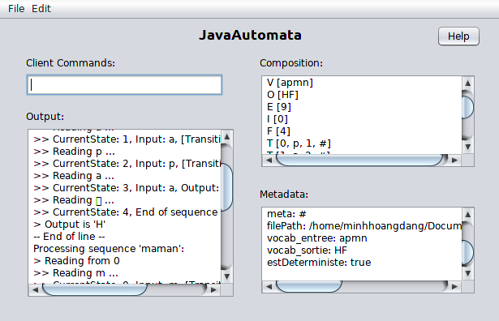

[](https://waffle.io/mhoangvslev/JavaAutomata)

# JavaAutomata 
A Java application capable of parsing, compile and interprete from .descr file.


# Features:
- Parsing and interprete from .descr file
- Export to .descr, .dot and .png
- Transforming from Non-Deterministic to Deterministic

# How it works


## .descr file:
```
line C (comment) ::= C
line M (meta) ::= M µ : the metacharacter representing lambda (default : #)
line V (in) ::= V "c[c]*" : input words (mandatory)
line O (out) ::= O "c[c]*" : output words (mandatory)
line E (nb) ::= E i : number of states (E = 0..N-1) (mandatory)
line I (init) ::= I i[ i]* : initial states (default : 0)
line F (final) ::= F [i[ i]*] : final states (mandatory)
line T (trans) ::= i 'x' i 'x' : ExVxExO transition
```
